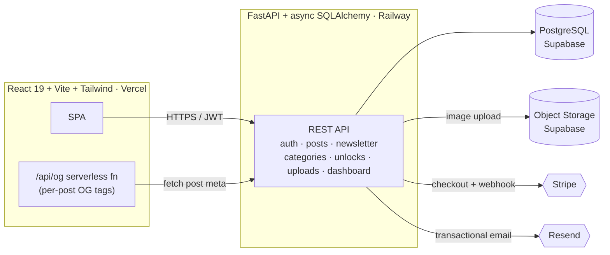

# SpinoSoftBits Blog

A full-stack, production-deployed publishing platform — built from scratch with a **Python / FastAPI** backend and a **React 19 / Vite** frontend. It runs a real blog with scheduled posts, a Stripe pay-to-unlock paywall, a double opt-in newsletter, image uploads, and per-post social previews.

**Live:** [blog.spinosoftbits.com](https://blog.spinosoftbits.com) &nbsp;·&nbsp; **Portfolio:** [spinosoftbits.com](https://spinosoftbits.com)

<p>
  
  
  
  
  
  
</p>

---

## Why this project

I build with the Node/Express stack on my main site, so I built this blog deliberately on a **different stack — Python, FastAPI, async SQLAlchemy** — to demonstrate that I can design and ship a complete, secure, production system regardless of language. It is not a tutorial clone: every feature here (scheduled drops, the paywall, the newsletter pipeline, the image system, social-preview generation) was designed, built, debugged in production, and deployed end-to-end by me.

---

## Feature highlights

**Publishing & content**
- Markup-light post editor with an **image manager** — upload to object storage, then place images in the body at any width/height, independent of the post's cover.
- **Scheduled drops** — posts can be queued with a future `drop_date` and stay locked (teaser only) until they go live.
- **Data-driven categories** — categories (with their own color palettes and typography) are stored in the DB and drive the UI, so new sections need no code change.
- A featured **carousel** with auto-rotation, and an **Archive** with debounced full-text search, category filters, and pagination.

**Monetization**
- **Stripe pay-to-unlock** for premium posts — no account required; access is granted via a signed unlock token tied to the post.

**Audience**
- **Double opt-in newsletter** — subscribe → confirmation email → welcome email, with branded HTML templates.
- Admin **broadcast tools** — send a specific post (with an opt-in cover image) or compose a custom rich-text email, to all subscribers or a selected subset.
- Transactional email via **Resend** on a verified domain.

**Distribution & SEO**
- **Per-post Open Graph generation** — a serverless function injects post-specific `og:`/`twitter:` tags so links unfurl correctly on LinkedIn, Facebook, Slack, iMessage, etc., with a per-post toggle for the preview image.

**Admin**
- JWT-secured admin area: full CMS (create/edit/schedule), category management, subscriber management, and a **dashboard** aggregating views, subscribers, revenue, and unlocks.

---

## Architecture



**Stack**

| Layer | Technology |
|------|------------|
| Frontend | React 19, Vite, Tailwind CSS, React Router |
| Backend | FastAPI, async SQLAlchemy, Pydantic |
| Database | PostgreSQL (Supabase) |
| Object storage | Supabase Storage |
| Payments | Stripe Checkout + webhooks |
| Email | Resend (verified domain) |
| Auth | JWT (Bearer) |
| Hosting | Vercel (frontend) · Railway (backend) |

---

## Engineering highlights

A few decisions worth calling out for fellow engineers:

- **Fully async backend.** FastAPI with async SQLAlchemy sessions and `selectinload` for relationship loading, so list/detail endpoints avoid N+1 queries under load.
- **Stateless paywall.** Premium access doesn't require a user account — unlocking issues a signed token bound to the post, verified on each read. This keeps the reader flow frictionless while still gating content server-side.
- **Server-rendered social previews on a SPA.** Since a React SPA serves an empty shell to crawlers, a Vercel serverless function intercepts `/post/:slug`, fetches the post's metadata, and injects per-post `og:`/`twitter:` tags into the HTML head — so links unfurl correctly everywhere while humans still get the full app.
- **Double opt-in pipeline.** Subscription generates a confirmation token; only confirmed addresses receive broadcasts, which keeps the list clean and deliverability high.
- **Secrets isolation for uploads.** Image uploads route browser → API → object storage so the privileged storage key never reaches the client.
- **Schema-safe migrations.** New capabilities (scheduled drops, categories, premium pricing, social-preview flags) were added as backward-compatible columns with sensible defaults, so existing rows keep working without backfills.

---

## Screenshots

> _Replace these with real screenshots — drop images in `docs/` and update the paths._

| Home / featured | Post + paywall |
|---|---|
|  |  |

| Admin CMS | Newsletter broadcast |
|---|---|
|  |  |

---

## Running locally

**Backend**
```bash
cd backend
python -m venv .venv && source .venv/bin/activate   # PowerShell on Windows: .venv\Scripts\Activate.ps1
pip install -r requirements.txt
uvicorn main:app --reload
```

**Frontend**
```bash
cd frontend
npm install
npm run dev
```

**Environment** — the backend reads configuration from environment variables (no secrets in the repo):

| Variable | Purpose |
|---|---|
| `DATABASE_URL` | PostgreSQL connection (Supabase) |
| `JWT_SECRET` | Signs auth tokens |
| `STRIPE_SECRET_KEY` / `STRIPE_WEBHOOK_SECRET` | Payments + webhook verification |
| `RESEND_API_KEY` / `FROM_EMAIL` | Transactional email |
| `SUPABASE_URL` / `SUPABASE_SERVICE_KEY` / `SUPABASE_BUCKET` | Image uploads to object storage |
| `BLOG_URL` / `BLOG_API_URL` | Public site + API base used by emails and OG tags |

The frontend reads `VITE_API_URL` for the backend base URL.

---

## About

Built and maintained by **Spinoza Delva** — founder of SpinoSoftBits, a Brooklyn-based engineering studio.

[Portfolio](https://spinosoftbits.com) · [GitHub](https://github.com/SpinozaDelva) · [LinkedIn](https://linkedin.com/in/spinozadelva)
